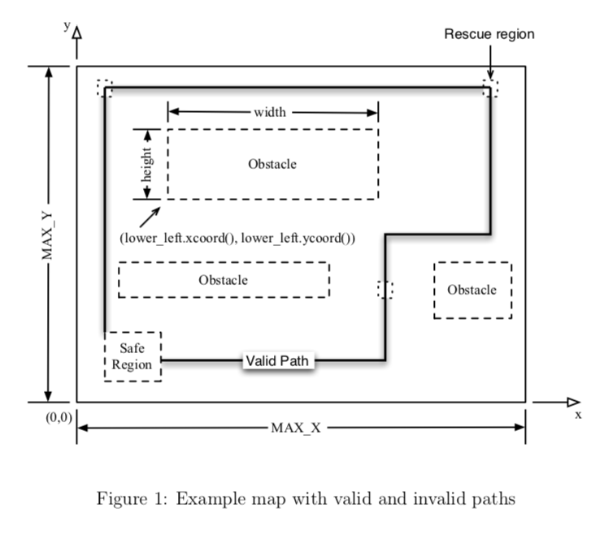

# Autonomous Rescue Robot
### Purpose
The purpose of this work is to design and implement the specifications for an autonomous rescue robot. The inspiration for the project is real life rescue robots, which are used when a disaster occurs and the conditions are too dangerous for human rescuers. 
### Background
The design and implementation will be focused on the route planning portion of the robot. The modules will deal with determining a path from a safe zone back to the safe zone, while passing through all rescure regions and avoiding all obstacles. Figure 1 shows a map of the area of interest. The lower left corner of the map is located at the origin of the *x-y* coordinate system. The map has length MAX_X in the *x* direction and length MAX_Y in the *y* direction. Any point outside the map area is considered to be an invalid input. Within the map there are rectangles (regions) for the safe zone, the rescue regions (destinations) and for the obstacles. Each rectangle is defined by the coordinate of its lower left corner, together with values for its width and its height. This information is identified in Figure 1 for one of the obstacle regions.
  
&ensp;&ensp;To rescue all of the potential victims, a valid path proceeds from the safe zone back to the safe zone, visits all of the rescue regions, does not cross any of the obstacles and respects the stated tolerances. The purposes of the tolerances is to allow for the fact that the robot may not be exactly where you plan it to be. The robot cannot be closer than TOLERANCE to an obstacles to take this into account. The robot is also allowed to "miss" the rescue regions and the safezone by the TOLERANCE amount. A path is made up of a sequence of points, where each point is defined as a tuple of *x* and *y* coordinates. The path is defined as the straight line connecting subsequent points. 
### Implementation Details
The modules specified in the [Module Interface Specifications (MIS)](specifications.pdf) are as follows: **Constants**, **PointT**, **RegionT**, **GenericList(T)**, **PathT**, **Obstacles**, **Destinations**, **SafeZone**, **Map** and **PathCalculation**. The specifications use discrete mathematics to specify the desired properties (i.e. *descriptive* as opposed to *operational*). All of the code is written in Java. All code files are documented using doxygen. 
### Testing
Module **TestPathCalculation.java** tests the implemented routines using JUnit. A rule named **test** is included in the makefile (named **Makefile**), which runs all test cases. 
#### Author
Michael Balas

#### License
[GNU General Public License](../LICENSE)
